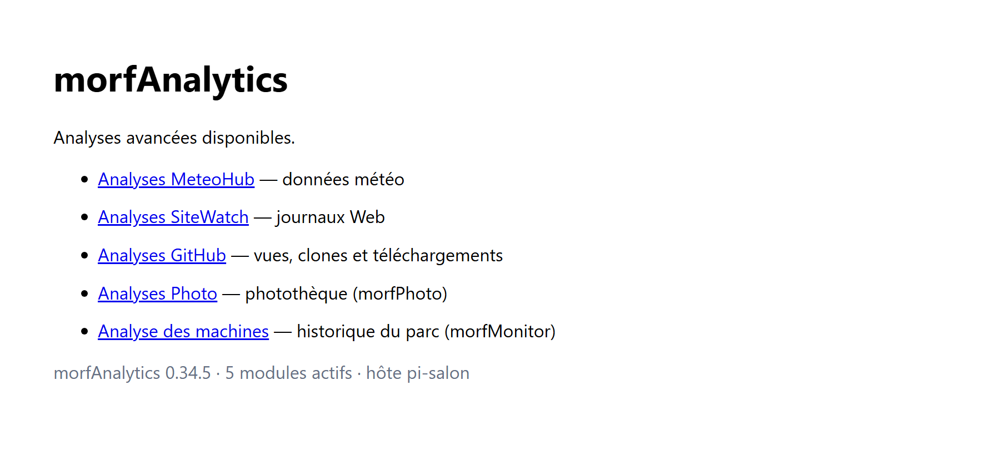
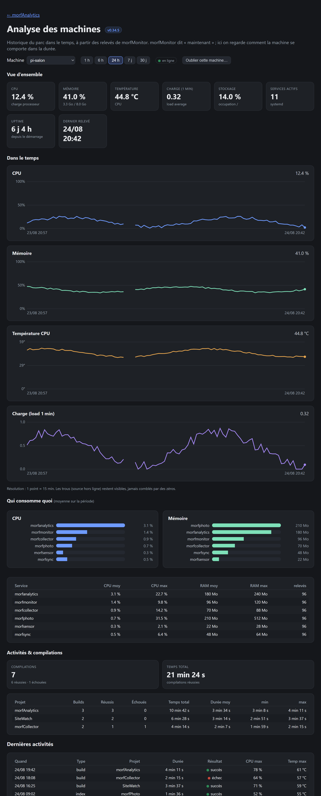
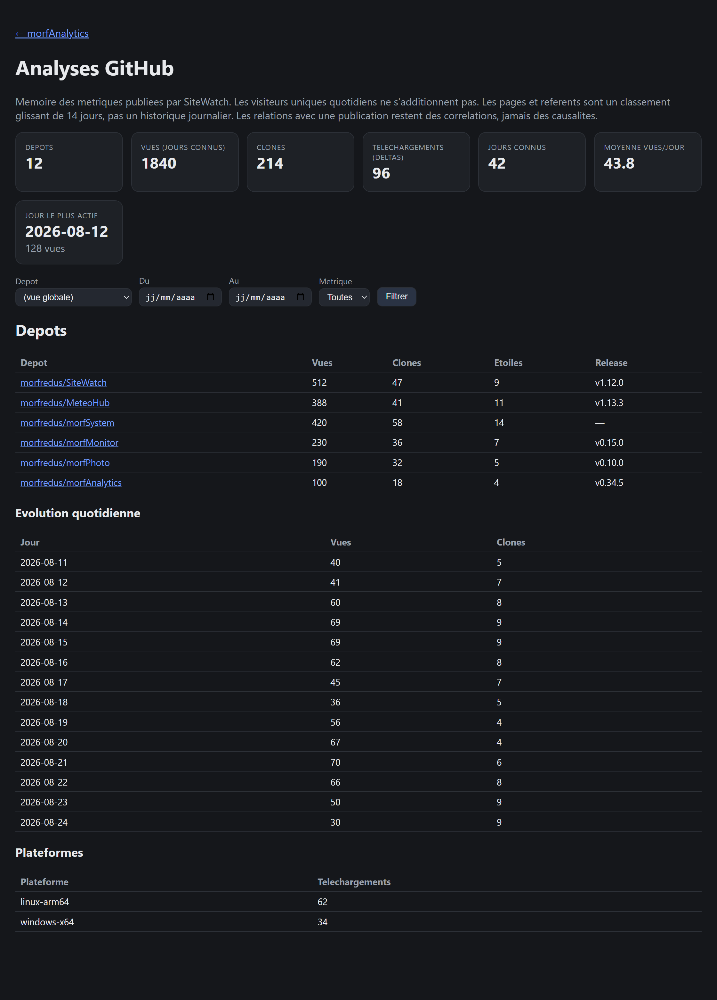
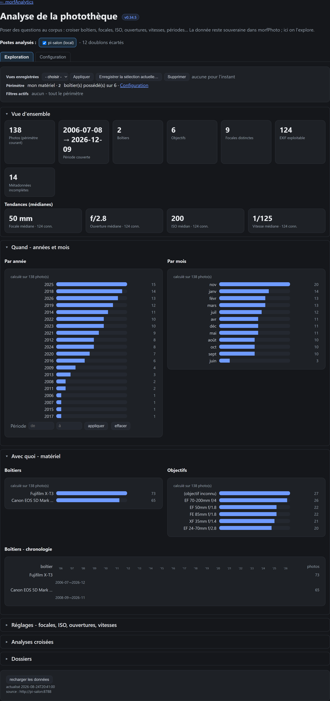

# Interface web

morfAnalytics sert ses analyses dans une interface web, à ouvrir dans un
navigateur sur son port HTTP (`http://<hôte>:8799`). Chaque domaine d'analyse a
sa page ; le portail les liste.

morfAnalytics ne possède aucune donnée : il lit une **copie** de ce que les
équipements et services du parc exposent (l'équipement reste la source de vérité),
puis l'agrège, l'historise et la représente.

> Les captures ci-dessous utilisent des **données d'exemple anonymisées** :
> valeurs, hôtes, dépôts et photothèque sont fictifs et ne servent qu'à illustrer
> l'interface.

## Portail

Point d'entrée : la liste des analyses disponibles (météo, journaux web, GitHub,
photothèque, machines du parc).

## Analyse des machines

L'historique du parc dans le temps, à partir des relevés de morfMonitor. morfMonitor
dit « maintenant » ; morfAnalytics regarde la **durée** : vue d'ensemble, séries
CPU / mémoire / température / charge (les trous d'une source hors ligne restent
visibles, jamais comblés par des zéros), consommation par service, et l'historique
des activités et compilations.

## Analyses GitHub

Mémoire des métriques publiées par SiteWatch : vues, clones, téléchargements,
évolution quotidienne et classement des dépôts.

## Analyse de la photothèque

Une vraie interface d'exploration du corpus (morfPhoto reste la source) : croiser
boîtiers, focales, ISO, ouvertures, vitesses et périodes. Vue d'ensemble et
médianes, répartition temporelle (par année / par mois), matériel (boîtiers,
objectifs, chronologie), réglages, analyses croisées et dossiers.

