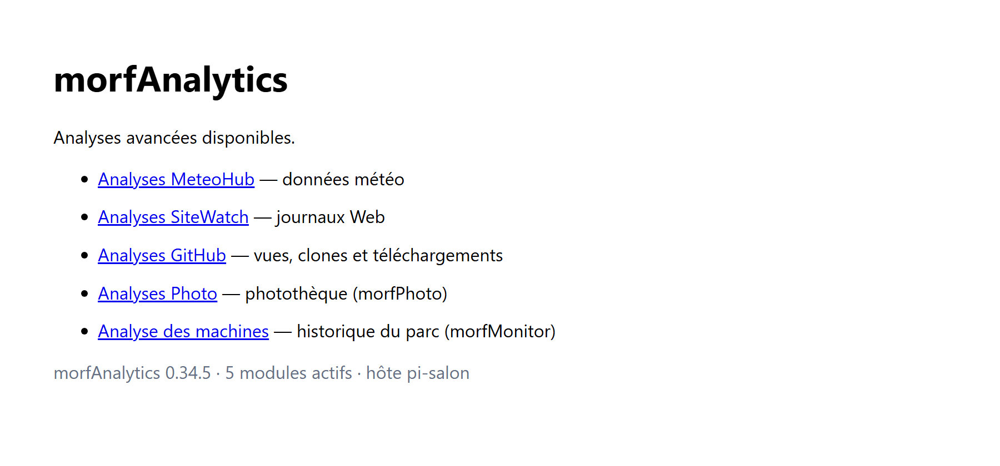
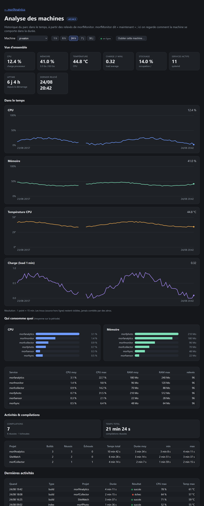
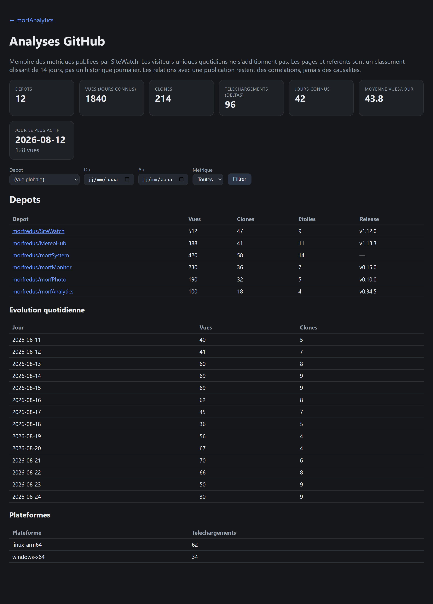
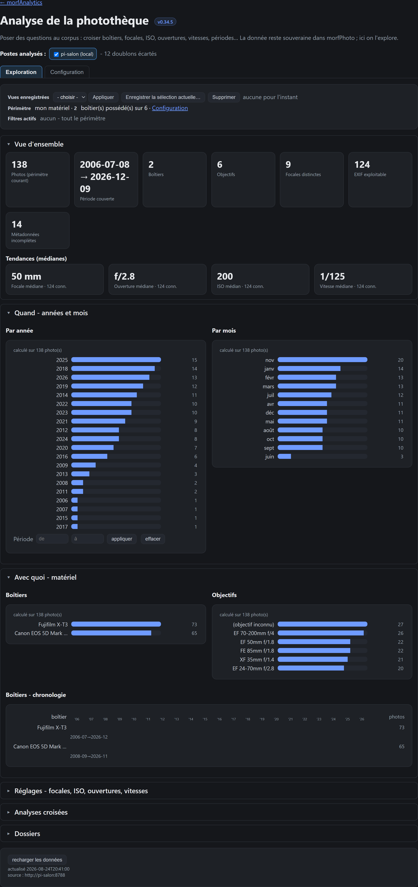

# Interface web

morfAnalytics sert ses analyses dans une interface web, à ouvrir dans un
navigateur sur son port HTTP (`http://<hôte>:8799`). Chaque domaine d'analyse a
sa page ; le portail les liste.

morfAnalytics ne possède aucune donnée : il lit une **copie** de ce que les
équipements et services du parc exposent (l'équipement reste la source de vérité),
puis l'agrège, l'historise et la représente.

## Thème et navigation, communs à toutes les pages

Toutes les pages partagent la même palette. Le thème **sombre** est le défaut ;
l'icône soleil / lune placée juste après la version, à côté du titre, bascule en
thème **clair**. Le choix est mémorisé dans le navigateur et vaut pour toutes les
pages de morfAnalytics.

En tête de chaque page (sauf le portail), un bandeau ramène à **morfAnalytics**.
Les pages Météo (Analyses et Graphiques) proposent en plus le retour vers
**MeteoHub**, la station dont elles lisent les mesures. Une application Web qui
ouvre une page de morfAnalytics peut ajouter `?back=<son adresse>&back_label=<son
nom>` au lien : le retour vers elle apparaît et reste proposé pendant la visite.
Une application de bureau (PhotoHub, SiteWatch) ouvre morfAnalytics dans le
navigateur : fermer l'onglet suffit pour la retrouver.

> Les captures ci-dessous utilisent des **données d'exemple anonymisées** :
> valeurs, hôtes, dépôts et photothèque sont fictifs et ne servent qu'à illustrer
> l'interface.

## Portail

Point d'entrée : la liste des analyses disponibles (météo, journaux web, GitHub,
photothèque, machines du parc).

## Météo

Le domaine météo (données recopiées depuis MeteoHub) a **deux onglets**, reliés par
une barre en haut de page :

- **Analyses** - « qu'est-ce que ça veut dire ? » : une carte par analyse (prévision
  locale, tendances, chaleur/humidex, sécheresse, brouillard, gelée, normales, cycle
  journalier, records, confort intérieur, comportement thermique du bâtiment, modèle
  d'inertie, prévu vs observé, complétude…). Chaque analyse a un **contexte** propre
  (Extérieur pour la météo, Intérieur pour le confort, les Deux pour les relations),
  rappelé par un badge ; un sélecteur global permet de forcer le contexte. Deux
  boutons : **Collecter et actualiser** (lance une vraie collecte depuis l'appareil)
  et **Rafraîchir l'affichage** (recalcule sur le cache déjà collecté). L'en-tête et
  les filtres restent **collants** en haut de la page : accessibles quel que soit le
  défilement, et changer un filtre ne renvoie plus tout en haut.

  La carte **Prévu vs observé** va plus loin qu'une photo du dernier jour : elle
  suit la qualité des prévisions sur plusieurs fenêtres (3, 7, 14 et 30 jours).
  Pour chaque fenêtre et chaque type de température (min/max), elle donne le biais
  (écart moyen signé), l'**erreur absolue moyenne (MAE) en °C** - l'indicateur de
  référence - la RMSE, et un **indice de fiabilité sur 100** qui n'est qu'une
  relecture de la MAE (jamais une probabilité de prévision correcte). En dessous de
  trois journées complètes comparées, la carte affiche « Données insuffisantes »
  plutôt qu'une valeur inventée. Un tableau d'évolution compare les fenêtres entre
  elles ; les détails (dernier jour comparé, RMSE) sont regroupés dans des blocs
  dépliables. La formule de l'indice et les seuils qualitatifs vivent, documentés,
  dans `ForecastQuality` (fonctions pures, testées isolément).

- **Graphiques** - « montre-moi ce qui s'est réellement passé » : l'évolution des
  grandeurs dans le temps. Les grandeurs à afficher se choisissent par **cases à
  cocher** (sélection libre : une seule, un couple température + humidité, humidité +
  pression, ou les trois). Une seule cochée donne la vue mono (Intérieur/Extérieur en
  deux couleurs) ; plusieurs se superposent, chacune avec son axe et sa couleur.
  Source **Intérieur / Extérieur / les deux** sur le même axe de temps. Période
  **glissante** (6 h, 12 h, 24 h, 3 j, 7 j, 30 j, fin = maintenant) ou **libre** : le
  bouton « Période libre » ouvre deux champs jour + heure (pas de 5 min, cadence de
  la sonde) pour revenir consulter un moment passé ; bornes arrondies à 5 min,
  étendue d'un an au plus, période mémorisée par le navigateur. Les endpoints
  `/meteohub/series` et `/meteohub/events` acceptent `from`/`to` (secondes epoch)
  en plus de `hours`. Échelles de valeurs à
  gauche et à droite (dynamiques), infobulle au survol donnant la valeur de chaque
  courbe à l'instant pointé. Les points sont reliés (une coupure = un vrai silence du
  capteur, jamais un simple espacement de cadence). En-tête et filtres **collants**,
  comme la page Analyse.
  - **Qualité** (0.58.0) : les points écartés par `MeteoQuality` (pic isolé, hors
    bornes, période annotée « sonde hors conditions ») ne participent ni aux
    courbes, ni aux échelles, ni aux événements. Ils sont dessinés en **croix
    grises** à leur valeur d'origine (ramenée dans le cadre si besoin), motif au
    survol ; la case « Points écartés » les masque. Une ligne « Qualité : N points
    écartés (… pic isolé, … sonde hors conditions) » résume la période affichée.
    La donnée brute reste intacte. Pour écarter une période où la sonde n'était
    pas dehors, ajouter une annotation de type « Sonde hors conditions » sur la
    page Analyses : l'effet est immédiat. La liste complète (date, source,
    grandeur, valeur d'origine, motif) se consulte sur la page Analyses, menu
    **Maintenance avancée** > **Points écartés** (0.61.0), sur 24 h, 7 ou 30 jours.
  - **Événements détectés** : sous le graphique, un encart chronologique. Les
    événements sont calculés côté serveur par une **source commune** (`MeteoEvents`),
    partagée avec la page Analyse et l'endpoint `/meteohub/events` (jamais recalculés
    différemment). Trois familles :
    - **Croisement de valeurs** : quand l'Intérieur ET l'Extérieur d'une même grandeur
      sont tracés, l'instant où les deux deviennent égales (changement de signe de
      `D(t) = Extérieur(t) - Intérieur(t)`). Heure et valeur interpolées entre les
      deux mesures encadrantes (une estimation, pas une mesure), jamais au travers
      d'un vrai trou ; une bande morte par grandeur écarte le bruit. Matérialisé par
      un guide vertical et un losange à la valeur estimée.
    - **Changement de régime** : plusieurs tendances qui basculent dans une fenêtre
      rapprochée, **même entre grandeurs de natures différentes** (relation TEMPORELLE,
      jamais déduite d'une proximité graphique). Matérialisé par un repère vertical.
    - Chaque marqueur porte un numéro qui le relie à sa ligne dans l'encart.
    Aucun croisement n'est jamais généré entre grandeurs différentes. C'est une
    première timeline analytique tirée directement des relations entre séries.

## Analyse des machines

L'historique du parc dans le temps, à partir des relevés de morfMonitor. morfMonitor
dit « maintenant » ; morfAnalytics regarde la **durée** : vue d'ensemble, séries
CPU / mémoire / température / charge (les trous d'une source hors ligne restent
visibles, jamais comblés par des zéros), consommation par service, et l'historique
des activités et compilations.

## Analyses GitHub

Mémoire des métriques publiées par SiteWatch : vues, clones, téléchargements,
évolution quotidienne et classement des dépôts.

## Analyse de la photothèque

Une vraie interface d'exploration du corpus (morfPhoto reste la source) : croiser
boîtiers, focales, ISO, ouvertures, vitesses et périodes. Vue d'ensemble et
médianes, répartition temporelle (par année / par mois), matériel (boîtiers,
objectifs, chronologie), réglages, analyses croisées et dossiers.

